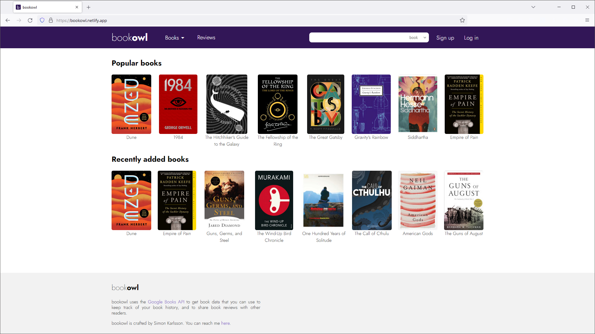

# bookowl
A web app to track your book history, including current reads, completed books, and future reading 
goals. Engage with the community by sharing your book reviews and exploring what others are reading.

Visit the site [here](https://bookowl.netlify.app/).

## Table of Contents
* [General Info](#general-information)
* [Built With](#built-with)
* [Features](#features)
* [Screenshots](#screenshots)
* [Setup](#setup)
* [Usage](#usage)
* [Contact](#contact)


## General Information
This project featuring a RESTful web server and database serves as the backend for the web app 
[bookowl](https://bookowl.netlify.app/). The frontend available in 
[this GitHub repository](https://github.com/sim-kar/bookowl-frontend).

Leveraging the [Google Books API](https://developers.google.com/books/), this CRUD app enables 
users to track their book history, write reviews, explore what others are reading, discover 
top-rated books, and more.

The primary goal of this project was to practice building a full-stack web app, complete with a 
REST API and a user registration/login system. The entire project is implemented using the MEAN 
tech stack (MongoDB, Express, Angular, Node.js). The Node.js backend is specifically built with 
TypeScript to match the Angular frontend.


## Built With
- TypeScript
- Node.js
- MongoDB
- Mongoose
- Express
- JSON Web Token
- Docker


## Features
- Provides a REST API with CRUD functionality built in Node.js. See all API endpoints under 
  [Usage](#usage) below.
- Integration of Google Books API to provide up-to-date book data for users to add to their library.
- User registration and login system using JSON Web Token for stateless authentication.
- Data storage in MongoDB, with passwords stored securely as salted hashes using 
  [argon2id](https://en.wikipedia.org/wiki/Argon2).
- Built and deployed as a Docker image.


## Screenshots



## Setup
For all project dependencies see *package.json*.

To get the project up and running, you need:
- [Node.js (16) and NPM](https://docs.npmjs.com/downloading-and-installing-node-js-and-npm)
- [MongoDB](https://www.mongodb.com/docs/manual/installation/) (tested with 5.0.4 as earliest 
  version)
- [Docker](https://docs.docker.com/get-docker/) (optional)

Instructions:

- Clone the repo.
- Navigate to the repo directory.
- Install dependencies with `npm install`
- To add the necessary environment variables for the dev environment, create a file named *.env*. 
  See *example.env* for reference. Adding environment variables to the production environment will
  vary depending on where and how you choose to deploy.
- Start the app
  - Developer environment: `npm run dev`
  - Production environment: `npm run start`

You can optionally create a docker image with the following command from the repo directory:  
`docker build `**`image-name`**` .`


## Usage
The webapp provides a REST API with the following enpoints:

### Books
- Search for books by title:  
  `GET api/books/title/`**`title`**`?limit=`**`limit`**

- Search for books by author:  
  `Get api/books/author/`**`author`**`?limit=`**`limit`**

- Get the highest rated books:  
  `GET api/books/highest-rated?limit=`**`limit`**

- Get the most recently updated books  
  `GET api/books/recently-updated?limit=`**`limit`**

- Get the most popular books:  
  `GET api/books/popular?limit=`**`limit`**

- Get a book by ISBN:  
  `GET api/books/`**`isbn`**

### Reviews
- Get all reviews:  
  `GET api/reviews/`

- Get reviews by ISBN:  
  `GET api/reviews/`**`isbn`**

- Get a review by ISBN and username:  
  `GET api/reviews/`**`username`**`/book/`**`isbn`**

The following routes require authorization in the form of a valid JSON Web Token matching the username making the request:

- Post a review:  
  `POST api/reviews/`

  ```JSON
  {
    "isbn": "isbn",
    "username": "username",
    "stars": 0-5,
    "text": "text"
  }
  ```

- Update a review:  
  `PUT api/reviews/`

  ```JSON
  {
    "isbn": "isbn",
    "username": "username",
    "stars": 0-5,
    "text": "text"
  }
  ```

- Delete a review:  
  `DELETE api/reviews/`**`username`**`/book/`**`isbn`**

### Users
- Get a user:  
  `GET api/users/`**`username`**

- Post a user:  
  `POST api/users/`

  ```JSON
  {
    "username": "username",
    "email" : "email",
    "password": "password",
    "gender": "gender",
    "birthdate": "birthdate"
  }
  ```

- User log in:  
  `POST api/users/login`

  ```JSON
  {
    "username": "username",
    "password": "password"
  }
  ```

The following routes require authorization in the form of a valid JSON Web Token matching the 
username making the request. Additionally, routes requiring a password will compare the submitted 
password to the encrypted password in the database.

- Get a user's email:  
  `GET api/users/`**`username`**`/email`

- Update a user's email:  
  `PUT api/users/email`

  ```JSON
  {
    "username": "username",
    "password": "password",
    "email": "email"
  }
  ```

- Update a user's password:  
  `PUT api/users/password`

  ```JSON
  {
    "username": "username",
    "oldPassword": "oldPassword",
    "newPassword": "newPassword"
  }
  ```

### Book Statuses
- Get a user's statuses by status code:  
  `GET api/statuses/`**`username`**`/status/`**`status`**

- Get a status by ISBN and username:  
  `GET api/statuses/`**`username`**`/book/`**`isbn`**

The following routes require authorization in the form of a valid JSON Web Token matching the 
username making the request:

- Post a status:  
  `POST api/statuses/`

  ```JSON
  {
    "isbn": "isbn",
    "username": "username",
    "status": "status",
    "book": "book"
  }
  ```

- Update a status:  
  `PUT api/statuses/`

  ```JSON
  {
    "isbn": "isbn",
    "username": "username",
    "status": "status",
    "book": "book"
  }
  ```

- Delete a status:  
  `DELETE api/statuses/`**`username`**`/book/`**`isbn`**


## Contact
Created by [Simon Karlsson](mailto:a.simon.karlsson@gmail.com) - feel free to contact me!
